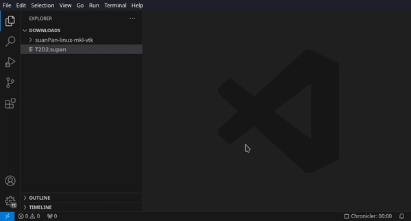

# suanPan

[🧮 **suanPan**](https://tlcfem.github.io/suanPan/) is an open source, parallel and heterogeneous finite element analysis framework.

This extension provides syntax highlighting and autocompletion for `suanPan` model files.

## Quick Start

1. download `suanPan`
2. install this extension `ext install tlc.suanpan`
3. enable tab completion (`Settings` -> `Editor: Tab Completion` -> `On`)
4. set path to the `suanPan` executable (`Settings` -> `suanPan` -> `Path`)
5. open a model file and edit
6. perform the analysis via `Ctrl+Shift+P` -> `suanPan: Run this model in suanPan`

## Demo

